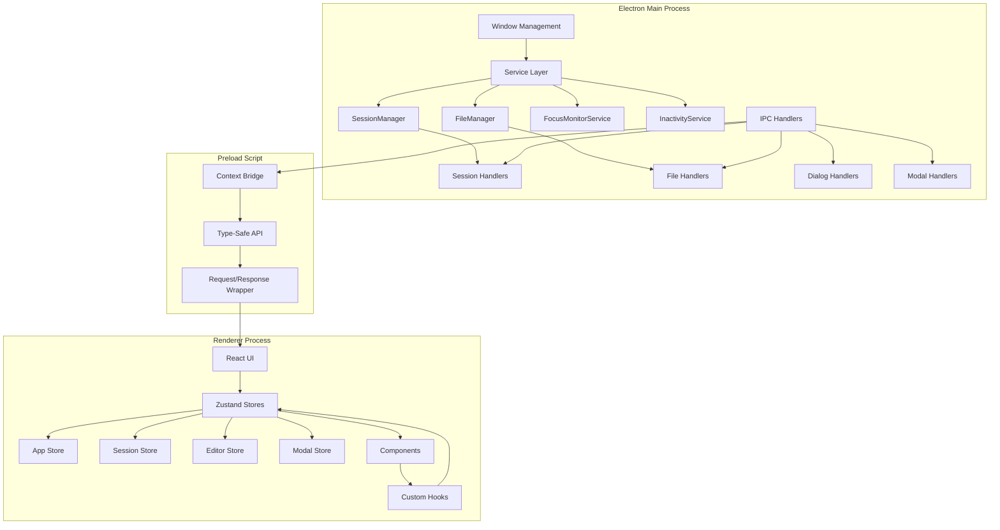
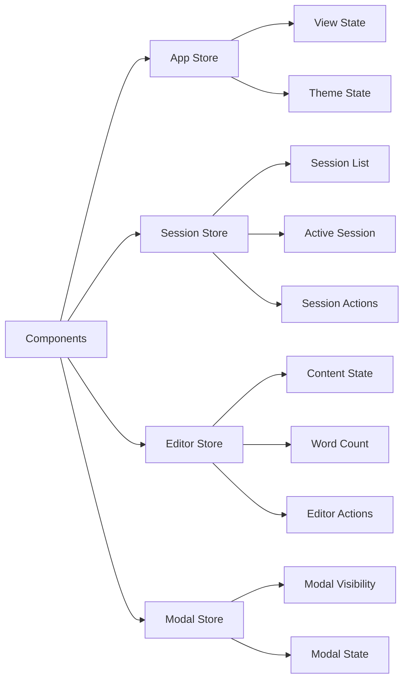
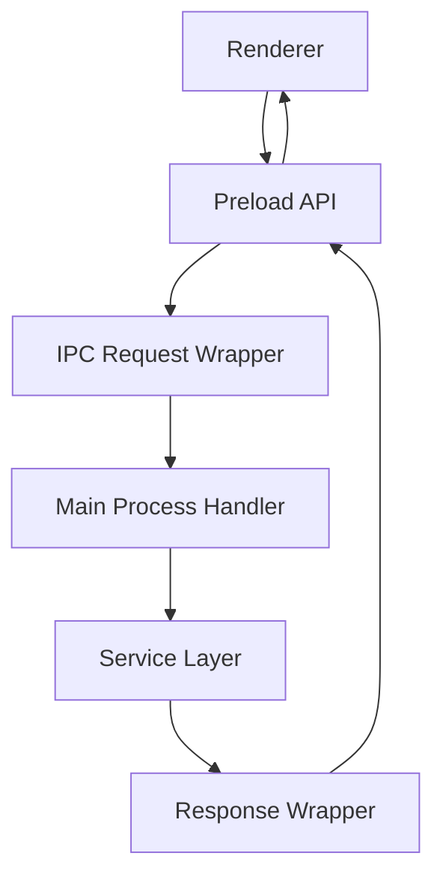
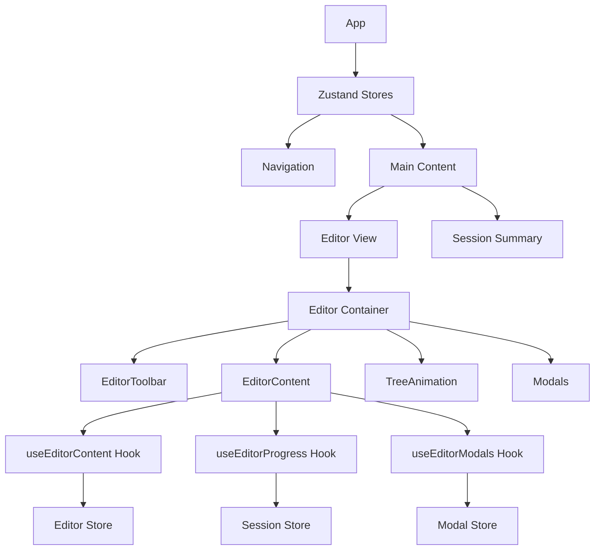
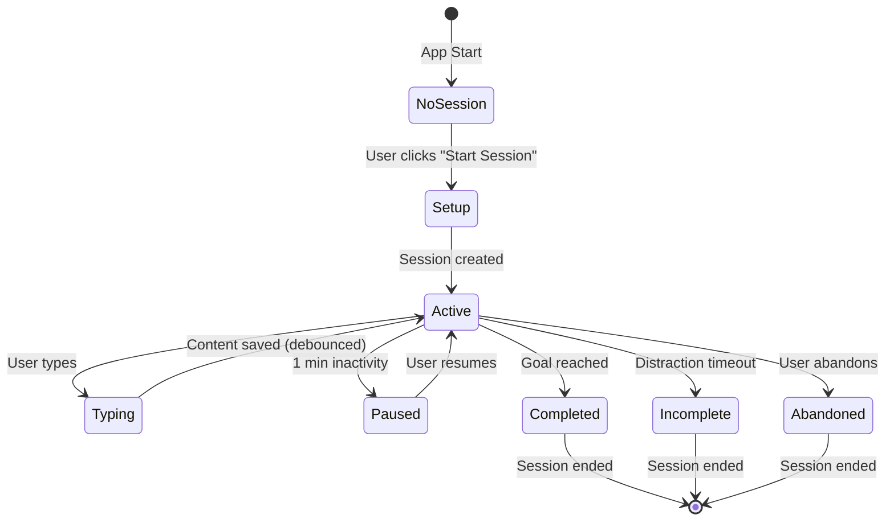
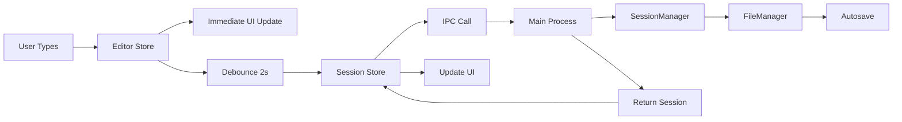
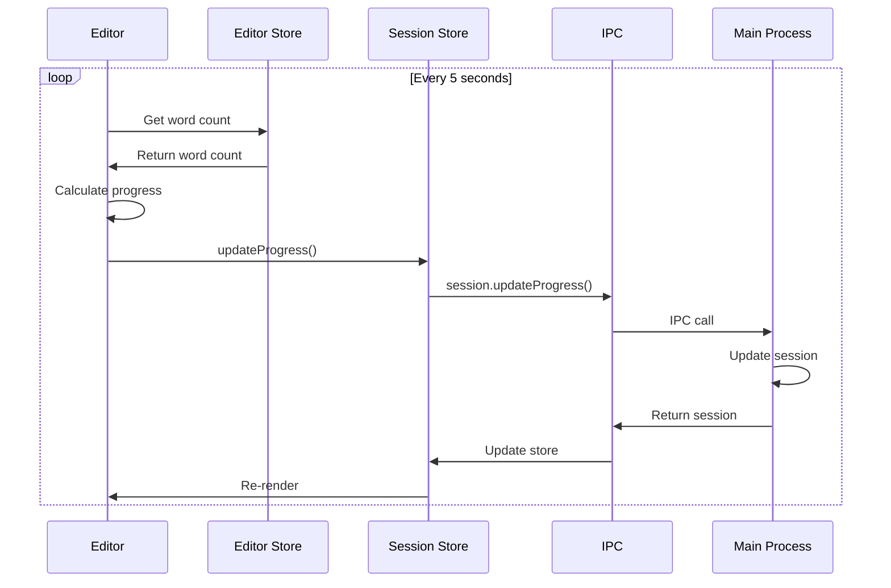

# Rewrite Architecture Overview

**Version:** 2.0  
**Status:** Implementation Guide  
**Last Updated:** December 2024

## System Architecture (Post-Rewrite)



## Key Architectural Changes

| Aspect | Old Architecture | New Architecture | Benefit |
|--------|-----------------|------------------|----------|
| **State Management** | React Context (330 lines) | Zustand Stores (4 files, ~400 lines total) | Better debugging, clearer separation |
| **IPC Structure** | 70+ channels in one file | Organized by domain (4 handler files) | Easier to understand and maintain |
| **Component Size** | Editor.tsx (658 lines) | Editor.tsx (100 lines) + hooks (3 files) | Better testability, clearer responsibilities |
| **Type Safety** | Partial, with workarounds | Full end-to-end type safety | Catch errors at compile time |
| **Debugging** | Console logs | Redux DevTools compatible | Visual state inspection |

## Process Responsibilities

### Main Process (Node.js)
- **Window Management**: Create, manage, and control Electron windows
- **Service Layer**: Business logic (SessionManager, FileManager, etc.)
- **IPC Handlers**: Organized by domain (session, file, dialog, modal)
- **System Integration**: Native OS features and notifications

### Preload Script (Context Bridge)
- **Security Layer**: Secure communication between main and renderer
- **Type-Safe API**: Request/response wrapper with full type safety
- **Error Handling**: Structured error responses
- **Validation**: Input validation before main process

### Renderer Process (React)
- **User Interface**: All UI components and interactions
- **State Management**: Zustand stores (app, session, editor, modal)
- **Text Editor**: Tiptap integration for writing experience
- **Animation System**: Tree growth animations and visual feedback
- **Custom Hooks**: Reusable logic for components

## State Management Architecture

### Store Structure



### Store Details

#### 1. App Store (`stores/appStore.ts`)
- **Purpose**: Application-level state (navigation, theme)
- **Size**: ~50 lines
- **Persistence**: localStorage
- **DevTools**: Yes

#### 2. Session Store (`stores/sessionStore.ts`)
- **Purpose**: Session management and lifecycle
- **Size**: ~150 lines
- **Persistence**: localStorage
- **DevTools**: Yes

#### 3. Editor Store (`stores/editorStore.ts`)
- **Purpose**: Editor local state (immediate UI updates)
- **Size**: ~80 lines
- **Persistence**: None (ephemeral)
- **DevTools**: Yes

#### 4. Modal Store (`stores/modalStore.ts`)
- **Purpose**: Modal visibility and state management
- **Size**: ~60 lines
- **Persistence**: None (ephemeral)
- **DevTools**: Yes

## IPC Communication Architecture

### New IPC Structure



### File Organization

```
src/main/ipc/
├── index.ts                    # Main registration (50 lines)
├── channels.ts                 # Channel constants (30 lines)
├── types.ts                    # Request/Response types (100 lines)
└── handlers/
    ├── sessionHandlers.ts      # Session operations (200 lines)
    ├── fileHandlers.ts         # File I/O (150 lines)
    ├── dialogHandlers.ts       # System dialogs (100 lines)
    └── modalHandlers.ts        # Floating modals (150 lines)
```

### Request/Response Pattern

All IPC communication uses a structured request/response pattern:

```typescript
// Request
interface IPCRequest<T> {
  type: string;
  payload: T;
}

// Response
interface IPCResponse<T> {
  success: boolean;
  data?: T;
  error?: string;
}
```

**Benefits:**
- Type-safe end-to-end
- Consistent error handling
- Easier to test
- Better debugging

## Component Architecture

### Component Hierarchy



### Editor Component Refactoring

#### Before (658 lines)
- All logic in one file
- Multiple responsibilities
- Hard to test
- Hard to debug

#### After (Modular)

```
components/Editor/
├── Editor.tsx                    # Container (100 lines)
├── EditorContent.tsx            # Tiptap editor (80 lines)
├── EditorToolbar.tsx            # Stats display (60 lines)
├── EditorEmptyState.tsx         # No session state (40 lines)
└── hooks/
    ├── useEditorContent.ts      # Content management (120 lines)
    ├── useEditorProgress.ts     # Progress tracking (100 lines)
    ├── useEditorModals.ts       # Modal management (150 lines)
    └── useEditorIPC.ts          # IPC integration (80 lines)
```

## Data Flow

### Complete Session Lifecycle



### State Update Flow



### Progress Tracking Flow



## File Structure

### Complete Directory Structure

```
src/
├── main/
│   ├── index.ts                          # Main process entry
│   ├── services/                         # Service layer (UNCHANGED)
│   │   ├── sessionManager.ts
│   │   ├── fileManager.ts
│   │   ├── FocusMonitorService.ts
│   │   └── InactivityService.ts
│   ├── ipc/                              # NEW: Organized IPC
│   │   ├── index.ts                      # Registration
│   │   ├── channels.ts                   # Channel constants
│   │   ├── types.ts                      # Request/Response types
│   │   └── handlers/
│   │       ├── sessionHandlers.ts
│   │       ├── fileHandlers.ts
│   │       ├── dialogHandlers.ts
│   │       └── modalHandlers.ts
│   └── types/                            # Type definitions (UNCHANGED)
│
├── preload/
│   ├── index.ts                          # NEW: Simplified API
│   └── index.d.ts                         # Type definitions
│
└── renderer/
    ├── src/
    │   ├── stores/                       # NEW: Zustand stores
    │   │   ├── appStore.ts
    │   │   ├── sessionStore.ts
    │   │   ├── editorStore.ts
    │   │   └── modalStore.ts
    │   │
    │   ├── components/                   # Refactored components
    │   │   ├── Editor/
    │   │   │   ├── Editor.tsx            # Simplified container
    │   │   │   ├── EditorContent.tsx
    │   │   │   ├── EditorToolbar.tsx
    │   │   │   ├── EditorEmptyState.tsx
    │   │   │   └── hooks/
    │   │   │       ├── useEditorContent.ts
    │   │   │       ├── useEditorProgress.ts
    │   │   │       ├── useEditorModals.ts
    │   │   │       └── useEditorIPC.ts
    │   │   ├── Modals/                   # UNCHANGED
    │   │   ├── Animation/                # UNCHANGED
    │   │   └── Session/                  # UNCHANGED
    │   │
    │   ├── hooks/                        # NEW: Feature hooks
    │   │   ├── useDebounce.ts            # UNCHANGED
    │   │   ├── useTimer.ts               # UNCHANGED
    │   │   └── useFloatingModal.ts      # UNCHANGED
    │   │
    │   ├── utils/                        # UNCHANGED
    │   ├── types/                        # UNCHANGED
    │   └── App.tsx                       # Simplified (no AppProvider)
    │
    └── assets/                           # UNCHANGED
```

### Key Changes Summary

| Path | Status | Notes |
|------|--------|-------|
| `src/main/services/` | ✅ Keep | No changes needed |
| `src/main/ipcHandlers.ts` | ❌ Remove | Replaced by `src/main/ipc/` |
| `src/renderer/src/context/` | ❌ Remove | Replaced by Zustand stores |
| `src/renderer/src/components/Editor/Editor.tsx` | 🔄 Refactor | Split into multiple files |
| `src/preload/index.ts` | 🔄 Refactor | Simplified API structure |

## Benefits Summary

### Debugging
- ✅ Redux DevTools integration
- ✅ Visual state inspection
- ✅ Time-travel debugging
- ✅ Better error messages

### Development
- ✅ Modular architecture
- ✅ Clear data flow
- ✅ Easy to add features
- ✅ Better code organization

### Code Quality
- ✅ Smaller files
- ✅ Better separation of concerns
- ✅ Easier to maintain
- ✅ Better testability

## Next Steps

1. **Read State Management Guide** - [STATE_MANAGEMENT.md](./STATE_MANAGEMENT.md)
2. **Review IPC Structure** - [IPC.md](./IPC.md)
3. **Follow Migration Guide** - [MIGRATION.md](./MIGRATION.md)

---

For detailed implementation guides, see:
- [State Management](./STATE_MANAGEMENT.md) - Zustand store patterns
- [IPC Communication](./IPC.md) - New IPC structure
- [Migration Guide](./MIGRATION.md) - Step-by-step migration plan

