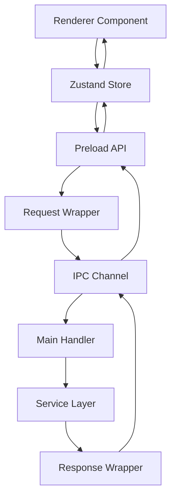

# Rewrite IPC Communication Architecture

**Version:** 2.0  
**Status:** Implementation Guide  
**Last Updated:** December 2024

## Overview

The rewrite reorganizes IPC communication with a type-safe request/response pattern and domain-based handler organization. This improves maintainability, debuggability, and type safety.

## Why Reorganize IPC?

### Current Issues

- **Monolithic File**: 70+ channels in one file (786 lines)
- **Hard to Navigate**: Difficult to find specific handlers
- **Type Safety**: Partial type safety with workarounds
- **Error Handling**: Inconsistent error handling patterns
- **Testing**: Difficult to test individual handlers

### New Structure Benefits

- **Organized by Domain**: Handlers grouped by functionality
- **Type-Safe**: End-to-end type safety
- **Consistent Pattern**: Request/response wrapper
- **Better Error Handling**: Structured error responses
- **Easier Testing**: Isolated handler testing

## New IPC Structure

### Architecture



### File Organization

```
src/main/ipc/
├── index.ts                    # Main registration (50 lines)
├── channels.ts                 # Channel constants (30 lines)
├── types.ts                    # Request/Response types (100 lines)
└── handlers/
    ├── sessionHandlers.ts      # Session operations (200 lines)
    ├── fileHandlers.ts         # File I/O (150 lines)
    ├── dialogHandlers.ts       # System dialogs (100 lines)
    └── modalHandlers.ts        # Floating modals (150 lines)
```

## Request/Response Pattern

### Type Definitions

```typescript
// src/main/ipc/types.ts

// Base request/response types
export interface IPCRequest<T = unknown> {
  type: string;
  payload: T;
}

export interface IPCResponse<T = unknown> {
  success: boolean;
  data?: T;
  error?: string;
}

// Session-specific types
export interface StartSessionRequest {
  filePath: string;
  name?: string;
  title?: string;
  goalType: 'word' | 'time';
  goalValue: number;
  initialContent?: string;
}

export interface UpdateProgressRequest {
  id: string;
  currentWords: number;
  timeElapsed: number;
  progressPercentage: number;
}

export interface EndSessionRequest {
  id: string;
  finalContent: string;
  finalWordCount: number;
}

// File-specific types
export interface ReadFileRequest {
  path: string;
}

export interface WriteFileRequest {
  path: string;
  content: string;
}

// Dialog-specific types
export interface ShowOpenDirectoryResponse {
  directoryPath?: string;
  canceled: boolean;
}

export interface ShowOpenFileResponse {
  filePath?: string;
  canceled: boolean;
}
```

### Channel Constants

```typescript
// src/main/ipc/channels.ts

export const IPC_CHANNELS = {
  // Session operations
  SESSION_START: 'session:start',
  SESSION_END: 'session:end',
  SESSION_UPDATE_CONTENT: 'session:update-content',
  SESSION_UPDATE_PROGRESS: 'session:update-progress',
  SESSION_PAUSE: 'session:pause',
  SESSION_RESUME: 'session:resume',
  SESSION_ABANDON: 'session:abandon',
  SESSION_MARK_INCOMPLETE: 'session:mark-incomplete',
  SESSION_GET_ACTIVE: 'session:get-active',
  SESSION_GET: 'session:get',
  SESSION_LIST: 'session:list',
  
  // File operations
  FILE_READ: 'file:read',
  FILE_READ_EXTERNAL: 'file:read-external',
  FILE_WRITE: 'file:write',
  FILE_EXISTS: 'file:exists',
  FILE_EXISTS_EXTERNAL: 'file:exists-external',
  
  // Dialog operations
  DIALOG_SHOW_OPEN_DIRECTORY: 'dialog:show-open-directory',
  DIALOG_SHOW_OPEN_FILE: 'dialog:show-open-file',
  DIALOG_GET_DEFAULT_SAVE_DIRECTORY: 'dialog:get-default-save-directory',
  DIALOG_OPEN_FOLDER: 'dialog:open-folder',
  
  // Modal operations
  FLOATING_MODAL_CREATE: 'floating-modal:create',
  FLOATING_MODAL_CLOSE: 'floating-modal:close',
  FLOATING_MODAL_CLOSE_ALL: 'floating-modal:close-all',
  
  // Activity operations
  ACTIVITY_TYPING: 'activity:typing',
} as const;
```

## Handler Implementation

### Session Handlers

```typescript
// src/main/ipc/handlers/sessionHandlers.ts

import { ipcMain } from 'electron';
import { sessionManager } from '../../services/sessionManager';
import { IPC_CHANNELS } from '../channels';
import type {
  IPCRequest,
  IPCResponse,
  StartSessionRequest,
  UpdateProgressRequest,
  EndSessionRequest,
  Session,
} from '../types';

export function registerSessionHandlers(): void {
  // Start session
  ipcMain.handle(
    IPC_CHANNELS.SESSION_START,
    async (
      _event,
      request: IPCRequest<StartSessionRequest>
    ): Promise<IPCResponse<Session>> => {
      try {
        const { filePath, name, title, goalType, goalValue, initialContent } =
          request.payload;

        const session = await sessionManager.startSession(
          filePath,
          name,
          title,
          goalType,
          goalValue,
          initialContent
        );

        return { success: true, data: session };
      } catch (error) {
        return {
          success: false,
          error: error instanceof Error ? error.message : 'Unknown error',
        };
      }
    }
  );

  // Update progress
  ipcMain.handle(
    IPC_CHANNELS.SESSION_UPDATE_PROGRESS,
    async (
      _event,
      request: IPCRequest<UpdateProgressRequest>
    ): Promise<IPCResponse<Session>> => {
      try {
        const { id, currentWords, timeElapsed, progressPercentage } =
          request.payload;

        const session = await sessionManager.updateProgress(
          id,
          currentWords,
          timeElapsed,
          progressPercentage
        );

        return { success: true, data: session };
      } catch (error) {
        return {
          success: false,
          error: error instanceof Error ? error.message : 'Unknown error',
        };
      }
    }
  );

  // End session
  ipcMain.handle(
    IPC_CHANNELS.SESSION_END,
    async (
      _event,
      request: IPCRequest<EndSessionRequest>
    ): Promise<IPCResponse<Session>> => {
      try {
        const { id, finalContent, finalWordCount } = request.payload;

        const session = await sessionManager.endSession(
          id,
          finalContent,
          finalWordCount
        );

        return { success: true, data: session };
      } catch (error) {
        return {
          success: false,
          error: error instanceof Error ? error.message : 'Unknown error',
        };
      }
    }
  );

  // Get active session
  ipcMain.handle(
    IPC_CHANNELS.SESSION_GET_ACTIVE,
    async (): Promise<IPCResponse<Session | undefined>> => {
      try {
        const session = sessionManager.getActiveSession();
        return { success: true, data: session };
      } catch (error) {
        return {
          success: false,
          error: error instanceof Error ? error.message : 'Unknown error',
        };
      }
    }
  );

  // ... other session handlers
}
```

### File Handlers

```typescript
// src/main/ipc/handlers/fileHandlers.ts

import { ipcMain } from 'electron';
import { fileManager } from '../../services/fileManager';
import { IPC_CHANNELS } from '../channels';
import type {
  IPCRequest,
  IPCResponse,
  ReadFileRequest,
  WriteFileRequest,
} from '../types';

export function registerFileHandlers(): void {
  // Read external file
  ipcMain.handle(
    IPC_CHANNELS.FILE_READ_EXTERNAL,
    async (
      _event,
      request: IPCRequest<ReadFileRequest>
    ): Promise<IPCResponse<string>> => {
      try {
        const { path } = request.payload;
        const content = await fileManager.readFileExternal(path);
        return { success: true, data: content };
      } catch (error) {
        return {
          success: false,
          error: error instanceof Error ? error.message : 'Unknown error',
        };
      }
    }
  );

  // Write external file
  ipcMain.handle(
    IPC_CHANNELS.FILE_WRITE,
    async (
      _event,
      request: IPCRequest<WriteFileRequest>
    ): Promise<IPCResponse<void>> => {
      try {
        const { path, content } = request.payload;
        await fileManager.writeFileExternal(path, content);
        return { success: true };
      } catch (error) {
        return {
          success: false,
          error: error instanceof Error ? error.message : 'Unknown error',
        };
      }
    }
  );

  // ... other file handlers
}
```

### Handler Registration

```typescript
// src/main/ipc/index.ts

import { registerSessionHandlers } from './handlers/sessionHandlers';
import { registerFileHandlers } from './handlers/fileHandlers';
import { registerDialogHandlers } from './handlers/dialogHandlers';
import { registerModalHandlers } from './handlers/modalHandlers';

export function registerIpcHandlers(): void {
  registerSessionHandlers();
  registerFileHandlers();
  registerDialogHandlers();
  registerModalHandlers();
}
```

## Preload API

### Simplified API Structure

```typescript
// src/preload/index.ts

import { contextBridge, ipcRenderer } from 'electron';
import type {
  IPCRequest,
  IPCResponse,
  StartSessionRequest,
  UpdateProgressRequest,
  EndSessionRequest,
  Session,
} from '../main/ipc/types';
import { IPC_CHANNELS } from '../main/ipc/channels';

// Session API
const sessionAPI = {
  start: async (params: StartSessionRequest): Promise<Session> => {
    const request: IPCRequest<StartSessionRequest> = {
      type: IPC_CHANNELS.SESSION_START,
      payload: params,
    };

    const response = (await ipcRenderer.invoke(
      IPC_CHANNELS.SESSION_START,
      request
    )) as IPCResponse<Session>;

    if (!response.success) {
      throw new Error(response.error || 'Failed to start session');
    }

    return response.data!;
  },

  updateProgress: async (
    params: UpdateProgressRequest
  ): Promise<Session> => {
    const request: IPCRequest<UpdateProgressRequest> = {
      type: IPC_CHANNELS.SESSION_UPDATE_PROGRESS,
      payload: params,
    };

    const response = (await ipcRenderer.invoke(
      IPC_CHANNELS.SESSION_UPDATE_PROGRESS,
      request
    )) as IPCResponse<Session>;

    if (!response.success) {
      throw new Error(response.error || 'Failed to update progress');
    }

    return response.data!;
  },

  end: async (params: EndSessionRequest): Promise<Session> => {
    const request: IPCRequest<EndSessionRequest> = {
      type: IPC_CHANNELS.SESSION_END,
      payload: params,
    };

    const response = (await ipcRenderer.invoke(
      IPC_CHANNELS.SESSION_END,
      request
    )) as IPCResponse<Session>;

    if (!response.success) {
      throw new Error(response.error || 'Failed to end session');
    }

    return response.data!;
  },

  getActive: async (): Promise<Session | undefined> => {
    const response = (await ipcRenderer.invoke(
      IPC_CHANNELS.SESSION_GET_ACTIVE
    )) as IPCResponse<Session | undefined>;

    if (!response.success) {
      throw new Error(response.error || 'Failed to get active session');
    }

    return response.data;
  },

  // ... other methods
};

// File API
const fileAPI = {
  readExternal: async (path: string): Promise<string> => {
    const request: IPCRequest<ReadFileRequest> = {
      type: IPC_CHANNELS.FILE_READ_EXTERNAL,
      payload: { path },
    };

    const response = (await ipcRenderer.invoke(
      IPC_CHANNELS.FILE_READ_EXTERNAL,
      request
    )) as IPCResponse<string>;

    if (!response.success) {
      throw new Error(response.error || 'Failed to read file');
    }

    return response.data!;
  },

  write: async (path: string, content: string): Promise<void> => {
    const request: IPCRequest<WriteFileRequest> = {
      type: IPC_CHANNELS.FILE_WRITE,
      payload: { path, content },
    };

    const response = (await ipcRenderer.invoke(
      IPC_CHANNELS.FILE_WRITE,
      request
    )) as IPCResponse<void>;

    if (!response.success) {
      throw new Error(response.error || 'Failed to write file');
    }
  },

  // ... other methods
};

// Expose API
contextBridge.exposeInMainWorld('api', {
  session: sessionAPI,
  file: fileAPI,
  dialog: dialogAPI,
  // ... other APIs
});
```

## Usage in Components

### Store Integration

```typescript
// stores/sessionStore.ts
startSession: async (params: StartSessionParams) => {
  const session = await window.api.session.start(params);
  get().addSession(session);
  return session;
},
```

### Direct Usage

```typescript
// components/SomeComponent.tsx
const handleStart = async () => {
  try {
    const session = await window.api.session.start({
      filePath: '/path/to/file.txt',
      name: 'My Session',
      goalType: 'word',
      goalValue: 500,
    });
    console.log('Session started:', session);
  } catch (error) {
    console.error('Failed to start session:', error);
  }
};
```

## Error Handling

### Consistent Error Pattern

All handlers follow the same error handling pattern:

```typescript
try {
  // Business logic
  const result = await service.method(params);
  return { success: true, data: result };
} catch (error) {
  return {
    success: false,
    error: error instanceof Error ? error.message : 'Unknown error',
  };
}
```

### Error Propagation

Errors are propagated through the response wrapper:

```typescript
// Preload throws error if response.success is false
if (!response.success) {
  throw new Error(response.error || 'Failed operation');
}
```

## Migration from Old IPC

### Before (Old Pattern)

```typescript
// Old: Direct parameters
ipcMain.handle('session:start', async (_event, filePath, name, title, goalType, goalValue) => {
  return await sessionManager.startSession(filePath, name, title, goalType, goalValue);
});

// Old: Direct call
const session = await ipcRenderer.invoke('session:start', filePath, name, title, goalType, goalValue);
```

### After (New Pattern)

```typescript
// New: Request wrapper
ipcMain.handle('session:start', async (_event, request: IPCRequest<StartSessionRequest>) => {
  const { filePath, name, title, goalType, goalValue } = request.payload;
  const session = await sessionManager.startSession(filePath, name, title, goalType, goalValue);
  return { success: true, data: session };
});

// New: Response wrapper
const response = await ipcRenderer.invoke('session:start', request);
if (!response.success) throw new Error(response.error);
const session = response.data;
```

## Testing

### Handler Testing

```typescript
import { ipcMain } from 'electron';
import { registerSessionHandlers } from './handlers/sessionHandlers';

describe('Session Handlers', () => {
  beforeEach(() => {
    registerSessionHandlers();
  });

  it('should start a session', async () => {
    const request: IPCRequest<StartSessionRequest> = {
      type: 'session:start',
      payload: {
        filePath: '/test.txt',
        goalType: 'word',
        goalValue: 500,
      },
    };

    const response = await ipcMain.handle('session:start', request);
    expect(response.success).toBe(true);
    expect(response.data).toBeDefined();
  });
});
```

## Benefits Summary

### Type Safety
- ✅ End-to-end type checking
- ✅ Compile-time error detection
- ✅ Better IDE support

### Maintainability
- ✅ Organized by domain
- ✅ Clear request/response pattern
- ✅ Consistent error handling

### Debugging
- ✅ Structured error messages
- ✅ Clear request/response flow
- ✅ Easier to trace issues

### Testing
- ✅ Isolated handler testing
- ✅ Mock request/response
- ✅ Test error cases

## Migration Checklist

- [ ] Create `src/main/ipc/` directory structure
- [ ] Create type definitions (`types.ts`)
- [ ] Create channel constants (`channels.ts`)
- [ ] Implement session handlers
- [ ] Implement file handlers
- [ ] Implement dialog handlers
- [ ] Implement modal handlers
- [ ] Update preload script
- [ ] Update stores to use new API
- [ ] Test all IPC communication
- [ ] Remove old IPC handlers

## Next Steps

1. **Review State Management** - [STATE_MANAGEMENT.md](./STATE_MANAGEMENT.md)
2. **Follow Migration Guide** - [MIGRATION.md](./MIGRATION.md)

---

For related information, see:
- [Architecture Overview](./ARCHITECTURE.md)
- [State Management](./STATE_MANAGEMENT.md)
- [Migration Guide](./MIGRATION.md)

