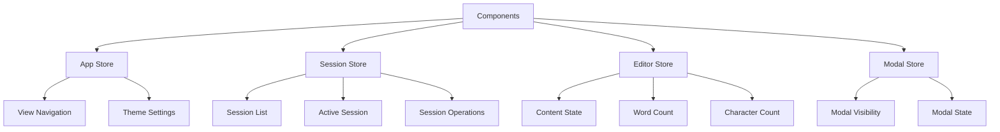

# Rewrite State Management Architecture

**Version:** 2.0  
**Status:** Implementation Guide  
**Last Updated:** December 2024

## Overview

The rewrite migrates from React Context to Zustand for state management. This provides better debugging capabilities, clearer separation of concerns, and improved developer experience.

## Why Zustand?

### Benefits Over Context

- **Redux DevTools Integration**: Visual state inspection and time-travel debugging
- **Less Boilerplate**: No provider wrapping needed
- **Better Performance**: Selective subscriptions prevent unnecessary re-renders
- **TypeScript Support**: Excellent type inference
- **Smaller Bundle**: ~1KB vs Context overhead
- **Easier Testing**: Stores can be tested independently

### Comparison

| Feature | React Context | Zustand |
|---------|--------------|---------|
| Boilerplate | High (Provider, hooks) | Low (direct store access) |
| DevTools | Limited | Redux DevTools compatible |
| Performance | All consumers re-render | Selective subscriptions |
| Type Safety | Manual typing | Automatic inference |
| Testing | Requires provider setup | Direct store testing |

## Store Architecture

### Store Structure



## Store Implementations

### 1. App Store (`stores/appStore.ts`)

**Purpose:** Application-level state (navigation, theme)

```typescript
import { create } from 'zustand';
import { devtools, persist } from 'zustand/middleware';

interface AppState {
  // State
  currentView: 'dashboard' | 'editor' | 'session-summary';
  theme: 'light' | 'dark' | 'system';
  
  // Actions
  setView: (view: AppState['currentView']) => void;
  setTheme: (theme: AppState['theme']) => void;
}

export const useAppStore = create<AppState>()(
  devtools(
    persist(
      (set) => ({
        // Initial state
        currentView: 'editor',
        theme: 'dark',
        
        // Actions
        setView: (view) => set({ currentView: view }, false, 'setView'),
        setTheme: (theme) => set({ theme }, false, 'setTheme'),
      }),
      {
        name: 'app-storage',
        partialize: (state) => ({
          currentView: state.currentView,
          theme: state.theme,
        }),
      }
    ),
    { name: 'AppStore' }
  )
);
```

**Key Features:**
- **Size**: ~50 lines
- **Persistence**: localStorage (app-storage key)
- **DevTools**: Yes (AppStore)
- **Selective Updates**: Components only re-render when subscribed state changes

### 2. Session Store (`stores/sessionStore.ts`)

**Purpose:** Session management and lifecycle

```typescript
import { create } from 'zustand';
import { devtools, persist } from 'zustand/middleware';
import type { Session } from '@renderer/types/session';

interface StartSessionParams {
  filePath: string;
  name?: string;
  title?: string;
  goalType: 'word' | 'time';
  goalValue: number;
  initialContent?: string;
}

interface SessionState {
  // State
  sessions: Session[];
  activeSessionId: string | null;
  
  // Computed
  activeSession: Session | null;
  
  // Actions (Synchronous)
  setActiveSession: (id: string | null) => void;
  addSession: (session: Session) => void;
  updateSession: (session: Session) => void;
  removeSession: (id: string) => void;
  
  // Actions (Asynchronous - IPC)
  startSession: (params: StartSessionParams) => Promise<Session>;
  endSession: (id: string, finalContent: string, finalWordCount: number) => Promise<Session>;
  updateProgress: (id: string, words: number, time: number, progress: number) => Promise<void>;
  pauseSession: (id: string) => Promise<void>;
  resumeSession: (id: string) => Promise<void>;
  abandonSession: (id: string) => Promise<void>;
  markIncomplete: (id: string) => Promise<void>;
}

export const useSessionStore = create<SessionState>()(
  devtools(
    persist(
      (set, get) => ({
        // Initial state
        sessions: [],
        activeSessionId: null,
        
        // Computed
        get activeSession() {
          const { sessions, activeSessionId } = get();
          return sessions.find(s => s.id === activeSessionId) || null;
        },
        
        // Actions
        setActiveSession: (id) => 
          set({ activeSessionId: id }, false, 'setActiveSession'),
        
        addSession: (session) => 
          set(
            (state) => ({
              sessions: [session, ...state.sessions],
              activeSessionId: session.id,
            }),
            false,
            'addSession'
          ),
        
        updateSession: (session) =>
          set(
            (state) => ({
              sessions: state.sessions.map(s => 
                s.id === session.id ? session : s
              ),
            }),
            false,
            'updateSession'
          ),
        
        removeSession: (id) =>
          set(
            (state) => ({
              sessions: state.sessions.filter(s => s.id !== id),
              activeSessionId: state.activeSessionId === id ? null : state.activeSessionId,
            }),
            false,
            'removeSession'
          ),
        
        // Async actions
        startSession: async (params) => {
          const session = await window.api.session.start(params);
          get().addSession(session);
          return session;
        },
        
        endSession: async (id, finalContent, finalWordCount) => {
          const session = await window.api.session.end({
            id,
            finalContent,
            finalWordCount,
          });
          get().updateSession(session);
          get().setActiveSession(null);
          return session;
        },
        
        updateProgress: async (id, words, time, progress) => {
          const session = await window.api.session.updateProgress({
            id,
            currentWords: words,
            timeElapsed: time,
            progressPercentage: progress,
          });
          get().updateSession(session);
        },
        
        pauseSession: async (id) => {
          const session = await window.api.session.pause(id);
          get().updateSession(session);
        },
        
        resumeSession: async (id) => {
          const session = await window.api.session.resume(id);
          get().updateSession(session);
        },
        
        abandonSession: async (id) => {
          const session = await window.api.session.abandon(id);
          get().updateSession(session);
          get().setActiveSession(null);
        },
        
        markIncomplete: async (id) => {
          const session = await window.api.session.markIncomplete(id);
          get().updateSession(session);
          get().setActiveSession(null);
        },
      }),
      {
        name: 'session-storage',
        partialize: (state) => ({
          sessions: state.sessions,
          activeSessionId: state.activeSessionId,
        }),
      }
    ),
    { name: 'SessionStore' }
  )
);
```

**Key Features:**
- **Size**: ~150 lines
- **Persistence**: localStorage (session-storage key)
- **DevTools**: Yes (SessionStore)
- **Computed Values**: `activeSession` computed from state
- **Async Actions**: All IPC calls handled in store

### 3. Editor Store (`stores/editorStore.ts`)

**Purpose:** Editor local state (immediate UI updates)

```typescript
import { create } from 'zustand';
import { devtools } from 'zustand/middleware';

interface EditorState {
  // State
  content: string;
  text: string;
  wordCount: number;
  characterCount: number;
  lastUpdated: number;
  
  // Actions
  updateContent: (content: string, text: string) => void;
  reset: () => void;
}

export const useEditorStore = create<EditorState>()(
  devtools(
    (set) => ({
      // Initial state
      content: '',
      text: '',
      wordCount: 0,
      characterCount: 0,
      lastUpdated: Date.now(),
      
      // Actions
      updateContent: (content, text) => {
        const wordCount = calculateWordCount(text);
        const characterCount = text.length;
        
        set(
          {
            content,
            text,
            wordCount,
            characterCount,
            lastUpdated: Date.now(),
          },
          false,
          'updateContent'
        );
      },
      
      reset: () =>
        set(
          {
            content: '',
            text: '',
            wordCount: 0,
            characterCount: 0,
            lastUpdated: Date.now(),
          },
          false,
          'reset'
        ),
    }),
    { name: 'EditorStore' }
  )
);
```

**Key Features:**
- **Size**: ~80 lines
- **Persistence**: None (ephemeral)
- **DevTools**: Yes (EditorStore)
- **Purpose**: Immediate UI updates without backend delays

### 4. Modal Store (`stores/modalStore.ts`)

**Purpose:** Modal visibility and state management

```typescript
import { create } from 'zustand';
import { devtools } from 'zustand/middleware';

interface ModalState {
  // State
  sessionSetup: boolean;
  inactivity: boolean;
  distraction: boolean;
  completion: boolean;
  distractionCountdown: number;
  
  // Actions
  showSessionSetup: () => void;
  hideSessionSetup: () => void;
  showInactivity: () => void;
  hideInactivity: () => void;
  showDistraction: () => void;
  hideDistraction: () => void;
  setDistractionCountdown: (seconds: number) => void;
  showCompletion: () => void;
  hideCompletion: () => void;
}

export const useModalStore = create<ModalState>()(
  devtools(
    (set) => ({
      // Initial state
      sessionSetup: false,
      inactivity: false,
      distraction: false,
      completion: false,
      distractionCountdown: 10,
      
      // Actions
      showSessionSetup: () => set({ sessionSetup: true }, false, 'showSessionSetup'),
      hideSessionSetup: () => set({ sessionSetup: false }, false, 'hideSessionSetup'),
      showInactivity: () => set({ inactivity: true }, false, 'showInactivity'),
      hideInactivity: () => set({ inactivity: false }, false, 'hideInactivity'),
      showDistraction: () => set({ distraction: true }, false, 'showDistraction'),
      hideDistraction: () => set({ distraction: false }, false, 'hideDistraction'),
      setDistractionCountdown: (seconds) =>
        set({ distractionCountdown: seconds }, false, 'setDistractionCountdown'),
      showCompletion: () => set({ completion: true }, false, 'showCompletion'),
      hideCompletion: () => set({ completion: false }, false, 'hideCompletion'),
    }),
    { name: 'ModalStore' }
  )
);
```

**Key Features:**
- **Size**: ~60 lines
- **Persistence**: None (ephemeral)
- **DevTools**: Yes (ModalStore)
- **Purpose**: Centralized modal state management

## Store Usage Patterns

### Component Usage

```typescript
// components/Editor/Editor.tsx
import { useSessionStore } from '@renderer/stores/sessionStore';
import { useEditorStore } from '@renderer/stores/editorStore';
import { useModalStore } from '@renderer/stores/modalStore';

export const Editor = () => {
  // Select only what you need (prevents unnecessary re-renders)
  const activeSession = useSessionStore(state => state.activeSession);
  const wordCount = useEditorStore(state => state.wordCount);
  const showInactivity = useModalStore(state => state.inactivity);
  
  // Actions
  const updateContent = useEditorStore(state => state.updateContent);
  const startSession = useSessionStore(state => state.startSession);
  
  // Usage
  const handleTyping = (content: string, text: string) => {
    updateContent(content, text); // Immediate UI update
  };
  
  return <div>Word count: {wordCount}</div>;
};
```

### Selective Subscriptions

Zustand allows components to subscribe only to the state they need:

```typescript
// ✅ Good: Only re-renders when wordCount changes
const wordCount = useEditorStore(state => state.wordCount);

// ✅ Good: Only re-renders when activeSession changes
const activeSession = useSessionStore(state => state.activeSession);

// ❌ Bad: Re-renders on any store change
const editorStore = useEditorStore();
```

### Async Actions

```typescript
// In component
const startSession = useSessionStore(state => state.startSession);

const handleStart = async () => {
  try {
    const session = await startSession({
      filePath: '/path/to/file.txt',
      name: 'My Session',
      goalType: 'word',
      goalValue: 500,
    });
    console.log('Session started:', session);
  } catch (error) {
    console.error('Failed to start session:', error);
  }
};
```

## Migration from Context

### Before (Context)

```typescript
// Old: Using Context
const { activeSession, startSession } = useSession();

const handleStart = async () => {
  const session = await startSession(...);
};
```

### After (Zustand)

```typescript
// New: Using Zustand
const activeSession = useSessionStore(state => state.activeSession);
const startSession = useSessionStore(state => state.startSession);

const handleStart = async () => {
  const session = await startSession(...);
};
```

### Key Differences

1. **No Provider Needed**: Zustand stores work without wrapping components
2. **Selective Subscriptions**: Only subscribe to needed state
3. **Direct Store Access**: No custom hooks needed (but can create for convenience)
4. **Better Performance**: Automatic memoization and selective updates

## DevTools Integration

### Setup

```typescript
// stores/index.ts
import { devtools } from 'zustand/middleware';

// Already included in store definitions above
export const useAppStore = create<AppState>()(
  devtools(
    // ... store definition
    { name: 'AppStore' }
  )
);
```

### Usage

1. Install Redux DevTools browser extension
2. Open DevTools in Electron app
3. Navigate to Redux tab
4. See all state changes with action names
5. Time-travel through state history

## Persistence Strategy

### App Store

```typescript
persist(
  (set) => ({ ... }),
  {
    name: 'app-storage',
    partialize: (state) => ({
      currentView: state.currentView,
      theme: state.theme,
    }),
  }
)
```

**Persistence:**
- Saves to localStorage
- Only persists specified fields
- Automatically restores on app start

### Session Store

```typescript
persist(
  (set, get) => ({ ... }),
  {
    name: 'session-storage',
    partialize: (state) => ({
      sessions: state.sessions,
      activeSessionId: state.activeSessionId,
    }),
  }
)
```

**Persistence:**
- Saves to localStorage
- Validates against backend on startup
- Clears invalid sessions

## Performance Considerations

### Selective Subscriptions

```typescript
// ✅ Good: Only re-renders when wordCount changes
const wordCount = useEditorStore(state => state.wordCount);

// ❌ Bad: Re-renders on any store change
const store = useEditorStore();
```

### Computed Values

```typescript
// In store definition
get activeSession() {
  const { sessions, activeSessionId } = get();
  return sessions.find(s => s.id === activeSessionId) || null;
}

// In component
const activeSession = useSessionStore(state => state.activeSession);
```

### Memoization

Zustand automatically memoizes selectors, so components only re-render when selected state actually changes.

## Testing

### Store Testing

```typescript
import { useSessionStore } from '@renderer/stores/sessionStore';

describe('SessionStore', () => {
  beforeEach(() => {
    useSessionStore.setState({
      sessions: [],
      activeSessionId: null,
    });
  });
  
  it('should add a session', () => {
    const session = { id: '1', name: 'Test' };
    useSessionStore.getState().addSession(session);
    
    expect(useSessionStore.getState().sessions).toContain(session);
  });
});
```

## Migration Checklist

- [ ] Install Zustand: `npm install zustand`
- [ ] Create store files in `src/renderer/src/stores/`
- [ ] Implement appStore.ts
- [ ] Implement sessionStore.ts
- [ ] Implement editorStore.ts
- [ ] Implement modalStore.ts
- [ ] Update components to use stores
- [ ] Remove old Context code
- [ ] Test all functionality
- [ ] Verify DevTools integration

## Next Steps

1. **Review IPC Structure** - [IPC.md](./IPC.md)
2. **Follow Migration Guide** - [MIGRATION.md](./MIGRATION.md)

---

For related information, see:
- [Architecture Overview](./ARCHITECTURE.md)
- [IPC Communication](./IPC.md)
- [Migration Guide](./MIGRATION.md)

