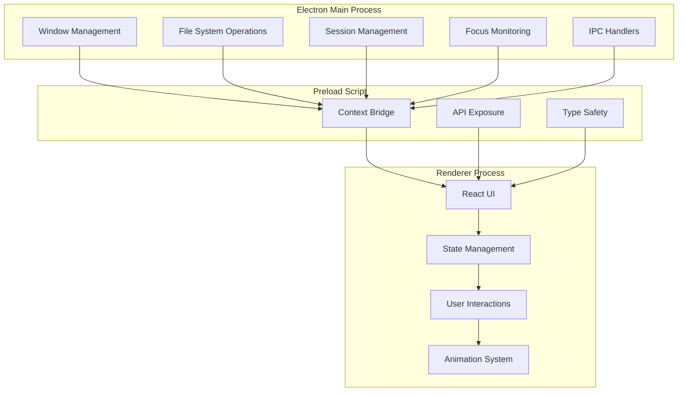
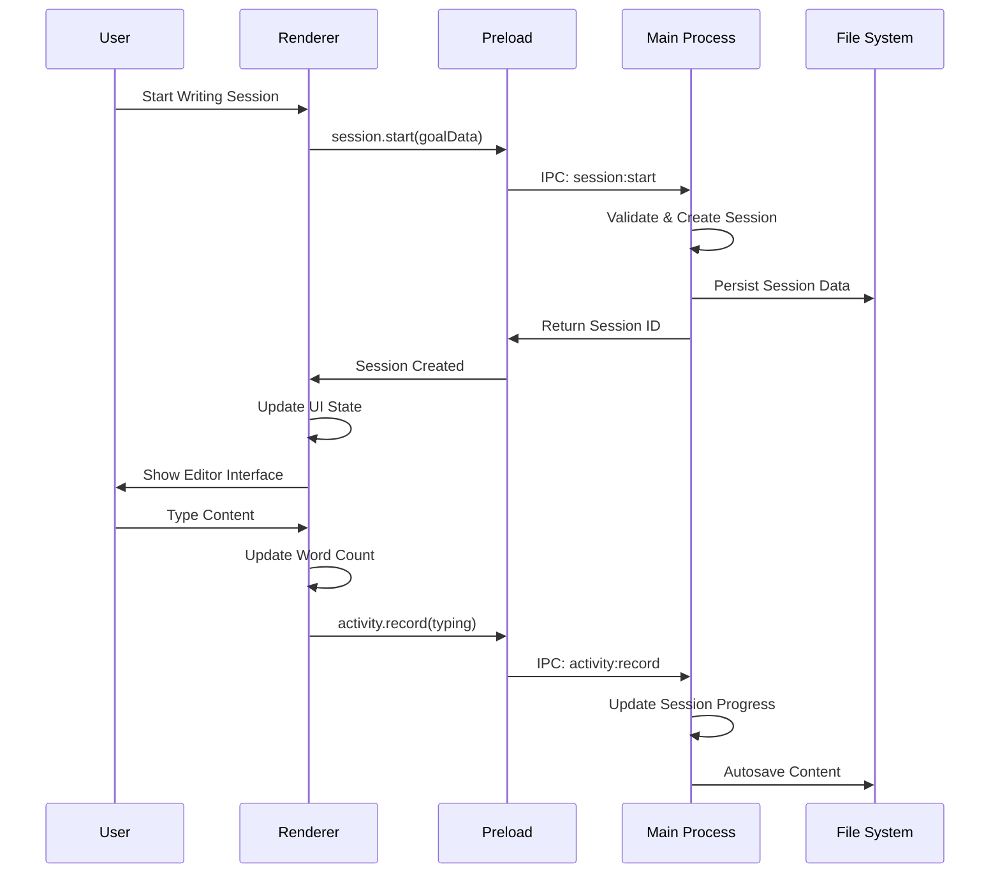
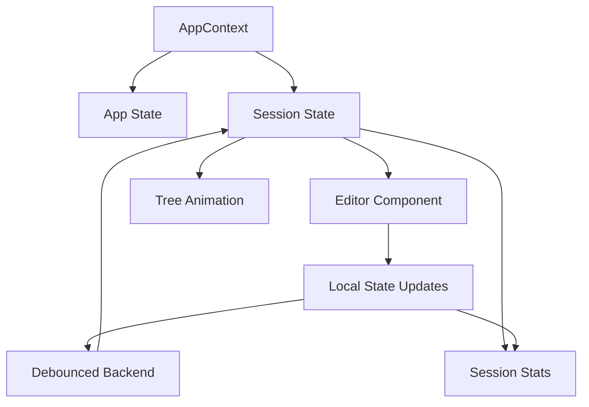

# Architecture Overview

High-level system design and architecture patterns for Draft Tree.

## System Architecture

Draft Tree follows a three-process Electron architecture with clear separation of concerns:



## Process Responsibilities

### Main Process (Node.js)
- **Window Management**: Create, manage, and control Electron windows
- **File System**: Handle file I/O operations (import/export/autosave)
- **Session Persistence**: Store and retrieve session data
- **Focus Monitoring**: Detect when user switches away from app
- **IPC Communication**: Handle requests from renderer process
- **System Integration**: Native OS features and notifications

### Preload Script (Context Bridge)
- **Security Layer**: Secure communication between main and renderer
- **API Exposure**: Expose limited, type-safe APIs to renderer
- **Type Definitions**: Provide TypeScript interfaces for IPC
- **Validation**: Basic input validation before main process

### Renderer Process (React)
- **User Interface**: All UI components and interactions
- **State Management**: React Context for application state
- **Text Editor**: Tiptap integration for writing experience
- **Animation System**: Tree growth animations and visual feedback
- **User Experience**: Modals, notifications, and responsive design

## Data Flow



## Key Design Patterns

### 1. Service Layer Pattern
All data operations go through service classes in the main process:

```typescript
// Main Process Service
export class SessionService {
  async startSession(data: SessionData): Promise<Session> {
    // Business logic
    const session = await this.createSession(data);
    await this.persistSession(session);
    return session;
  }
}

// IPC Handler
ipcMain.handle('session:start', async (event, data) => {
  return await sessionService.startSession(data);
});
```

### 2. Context Bridge Pattern
Secure API exposure through preload scripts:

```typescript
// Preload Script
contextBridge.exposeInMainWorld('electronAPI', {
  session: {
    start: (data: SessionData) => ipcRenderer.invoke('session:start', data),
    end: (id: string) => ipcRenderer.invoke('session:end', id)
  }
});
```

### 3. State Management Pattern
Consolidated state with single AppContext:

```typescript
// Consolidated Context Provider
export const AppProvider = ({ children }: { children: ReactNode }) => {
  // App state
  const [appState, setAppState] = useState<AppState>(() => loadAppState());
  
  // Session state
  const [sessions, setSessions] = useState<Session[]>(() => loadSessionState().sessions);
  const [activeSessionId, setActiveSessionId] = useState<string | null>(null);
  
  // Provides both app and session management
  return (
    <AppContext.Provider value={{
      appState,
      setView,
      sessions,
      activeSession,
      startSession,
      endSession,
      updateProgress,
      // ... other session methods
    }}>
      {children}
    </AppContext.Provider>
  );
};

// Custom Hooks
export const useAppState = () => {
  const context = useContext(AppContext);
  if (!context) throw new Error('useAppState must be used within AppProvider');
  return context;
};

export const useSession = () => {
  const context = useContext(AppContext);
  if (!context) throw new Error('useSession must be used within AppProvider');
  return {
    activeSession: context.activeSession,
    startSession: context.startSession,
    endSession: context.endSession,
    // ... other session methods
  };
};
```

## Component Architecture

### Component Hierarchy
```
App
├── AppProvider (Consolidated Context)
├── Navigation Buttons
├── Dashboard (minimal implementation)
└── Editor
    ├── EditorTitle
    ├── SessionStats (word count, timer, progress)
    ├── Tiptap Editor (with local state)
    ├── TreeAnimation
    └── Modals
        ├── SessionSetupModal
        ├── InactivityModal
        ├── FloatingDistractionWarning
        └── CompletionModal
```

### State Flow


## Security Model

### Context Isolation
- **Node Integration**: Disabled in renderer
- **Context Isolation**: Enabled for security
- **Preload Scripts**: Only way to access Node.js APIs
- **Content Security Policy**: Enforced to prevent XSS

### API Exposure
- **Limited Surface**: Only necessary APIs exposed
- **Type Safety**: All APIs have TypeScript definitions
- **Validation**: Input validation at preload boundary
- **Error Handling**: Secure error propagation

## Performance Considerations

### Memory Management
- **Component Memoization**: React.memo for expensive components
- **Event Cleanup**: Proper cleanup of event listeners
- **Animation Optimization**: Efficient Lottie rendering
- **State Optimization**: Minimal re-renders through proper state structure

### IPC Optimization
- **Debounced Updates**: Reduce IPC frequency for frequent operations
- **Batch Operations**: Group related operations
- **Error Handling**: Graceful degradation on IPC failures
- **Type Safety**: Compile-time validation of IPC calls

## Testing Strategy

### Test Architecture
```
tests/
├── main/           # Main process tests
├── preload/        # Preload script tests
├── renderer/       # Renderer process tests
└── setup.ts        # Global test setup
```

### Testing Patterns
- **Unit Tests**: Individual functions and components
- **Integration Tests**: IPC communication and data flow
- **Component Tests**: React components with React Testing Library
- **Mock Strategy**: Mock external dependencies at boundaries

## Development Workflow

### Hot Reload Strategy
- **Renderer**: Vite HMR for React components
- **Main Process**: Auto-restart on changes
- **Preload**: Manual restart required for changes
- **Assets**: Automatic reload for static files

### Build Process
- **Development**: `npm run dev` - Hot reload enabled
- **Production**: `npm run build` - Optimized bundle
- **Testing**: `npm run test` - Vitest with coverage
- **Linting**: `npm run lint` - ESLint with TypeScript rules

## Future Extensibility

### Modular Design
- **Service Layer**: Clean separation between SessionManager, FileManager, and other services
- **Component System**: Reusable UI components with CSS Modules
- **Context-Based State**: Single AppContext for simplified state management
- **Type-Safe IPC**: Centralized IPC handlers with TypeScript

### Scalability Considerations
- **State Management**: Context-based with option to migrate to Redux/Zustand if needed
- **Component Library**: Reusable components across features
- **Service Architecture**: Modular services in main process
- **Testing Infrastructure**: Vitest with comprehensive test coverage

---

For detailed implementation guides, see:
- [Project Structure](./PROJECT_STRUCTURE.md)
- [IPC Communication](./IPC_COMMUNICATION.md)
- [State Management](./STATE_MANAGEMENT.md)
- [Features](./FEATURES.md)
