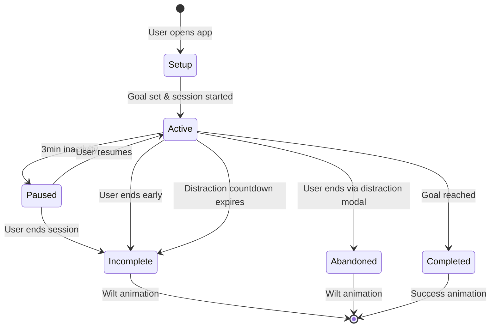

# Session Lifecycle

Complete flow of writing sessions from creation to completion or abandonment in Draft Tree.

## Session Flow Overview



## Session States

### 1. Setup Phase
**Purpose**: User configures session parameters before starting

**User Actions**:
- Select goal type (word count or time duration)
- Set goal value within valid ranges
- Choose file path (new file or existing file)
- Optionally set session name and title
- Review recommended settings: "15-30 min or 250-500 words for focused sessions"

**Validation Rules**:
- Word goals: 100-10,000 words
- Time goals: 5-480 minutes (8 hours)
- Real-time validation feedback
- File path required

**Data Structure**:
```typescript
// Setup modal state
interface SessionSetupState {
  filePath: string;
  name?: string;
  title?: string;
  goalType: 'word' | 'time';
  goalValue: number;
  initialContent?: string;
  isLoadingExisting?: boolean;
}
```

### 2. Active Phase
**Purpose**: User is actively writing toward their goal

**Key Features**:
- Real-time word count tracking (local state, immediate)
- Progress visualization (progress bar with percentage)
- Tree growth animation (8 stages)
- Timer display (1-second updates, focus-aware)
- Content autosave (2-second debounce to backend)
- File autosave (10 seconds via SessionManager)
- Progress updates (5-second intervals)

**State Management**:
```typescript
// Session stored in AppContext and backend
interface ActiveSession {
  id: string;
  name: string;
  title?: string;
  filePath: string;
  startTime: number;
  goalType: 'word' | 'time';
  goalValue: number;
  currentWords?: number;
  timeElapsed?: number;
  progressPercentage?: number;
  isPaused?: boolean;
  pauseStartTime?: number;
  totalPauseTime?: number;
  distractionCount?: number;
  initialWordCount?: number;
  status: 'active';
}

// Local editor state (immediate UI updates)
interface LocalEditorState {
  content: string;
  text: string;
  wordCount: number;
  characterCount: number;
  lastUpdated: number;
}
```

**Progress Calculation**:
```typescript
// Word count goals (only new words count)
const newWords = currentWords - (initialWordCount || 0);
const progress = Math.min(100, Math.floor((newWords / goalValue) * 100));

// Time goals
const progress = Math.min(100, Math.floor((timeElapsed / (goalValue * 60 * 1000)) * 100));
```

### 3. Paused Phase
**Trigger**: No typing activity for 1 minute

**Purpose**: Maintain accurate session timing without penalties

**User Experience**:
- Session timer continues (pause time tracked separately)
- Inactivity modal appears
- Clear messaging about pause (not penalty)
- Easy resume option
- "Taking a thinking break is normal!" message

**Modal Content**:
- "Session Paused" heading with pause icon
- "We noticed you haven't typed for a while..."
- Current session stats (word count, time elapsed, progress)
- "Resume Writing" (primary) and "End Session" (secondary) buttons

**State Updates**:
```typescript
// Session state
interface PausedSession {
  // ... all Session fields
  isPaused: true;
  pauseStartTime: number;
  totalPauseTime: number; // Accumulated pause duration
}
```

**Backend Integration**:
```typescript
// Pause session (called by InactivityService)
await window.api.session.pause(sessionId);

// Resume session (called when user resumes)
await window.api.session.resume(sessionId);
```

### 4. Completed Phase
**Trigger**: User reaches their set goal (100% progress)

**Success Criteria**:
- Word goals: Written target number of NEW words (excluding initialWordCount)
- Time goals: Elapsed target duration

**User Experience**:
- Completion modal appears automatically (once per session)
- Shows final word count and time elapsed
- Displays goal value and type
- "Keep Writing" button (dismisses modal, session continues)
- "End Session" button (ends session, navigates to summary)
- Tree shows fully grown state (stage 7)

**Modal Detection**:
```typescript
// Triggered when progress reaches 100%
if (currentProgress >= 100 && !hasShownCompletionModal) {
  setShowCompletionModal(true);
  setHasShownCompletionModal(true);
}
```

**Data Persistence**:
```typescript
interface CompletedSession {
  id: string;
  name: string;
  filePath: string;
  startTime: number;
  endTime: number;
  goalType: 'word' | 'time';
  goalValue: number;
  currentWords: number;
  timeElapsed: number;
  totalPauseTime: number;
  status: 'completed';
  progressPercentage: 100;
  distractionCount?: number;
  createdAt: string;
  updatedAt: string;
}
```

### 5. Incomplete Phase
**Trigger**: Session ends before reaching goal

**Triggers**:
- User manually clicks "End Session" in inactivity modal
- Distraction warning countdown expires (10 seconds)

**User Experience**:
- Session content saved to file
- Session marked as incomplete
- Active session cleared from app state
- Editor returns to "Ready to Start Writing?" state
- User must start new session to continue writing

**Data Persistence**:
```typescript
interface IncompleteSession {
  id: string;
  name: string;
  filePath: string;
  startTime: number;
  endTime: number;
  goalType: 'word' | 'time';
  goalValue: number;
  currentWords: number;
  timeElapsed: number;
  totalPauseTime: number;
  status: 'incomplete';
  progressPercentage: number; // < 100
  distractionCount: number;
  createdAt: string;
  updatedAt: string;
}
```

**Backend Integration**:
```typescript
// Mark session as incomplete
await window.api.session.markIncomplete(sessionId);
```

### 6. Incomplete Phase (Distraction)
**Trigger**: User switches away from app and doesn't return within 10 seconds

**Distraction Warning Flow**:
1. User switches away from app
2. Distraction warning modal appears
3. 10-second countdown begins
4. If user returns: warning dismissed, session continues, distraction count incremented
5. If countdown expires: session marked as incomplete

**Warning Modal Content**:
- "Stay Focused?" heading
- "You are about to leave your writing session..."
- Countdown timer display
- "Return to Session" (primary) and "End Session Anyway" (secondary) buttons

**Post-Distraction Behavior**:
- Session content is saved before marking as incomplete
- Active session is cleared from app state
- Editor returns to "Ready to Start Writing?" state
- User must explicitly start a new session to continue writing

**Incomplete Session Logic**:
```typescript
interface IncompleteSession {
  id: string;
  startTime: number;
  endTime: number;
  goalType: 'word' | 'time';
  goalValue: number;
  wordsWritten: number;
  timeElapsed: number;
  status: 'incomplete';
  completionRate: number; // < 100
  treeState: 'wilted' | 'dead';
  distractionCount: number;
}
```

### 7. Abandoned Phase
**Trigger**: User manually selects "End Session Anyway" from distraction warning

**User Experience**:
- Session ends immediately without countdown
- Session content saved to file
- Session marked as abandoned
- Active session cleared from app state
- Editor returns to "Ready to Start Writing?" state
- Statistics reflect abandoned session

**Abandonment Logic**:
```typescript
interface AbandonedSession {
  id: string;
  name: string;
  filePath: string;
  startTime: number;
  endTime: number;
  goalType: 'word' | 'time';
  goalValue: number;
  currentWords: number;
  timeElapsed: number;
  totalPauseTime: number;
  status: 'abandoned';
  progressPercentage: number; // < 100
  distractionCount: number;
  isAbandoned: true;
  createdAt: string;
  updatedAt: string;
}
```

**Backend Integration**:
```typescript
// Abandon session (explicit user choice)
await window.api.session.abandon(sessionId);
```

## State Transitions

### Transition Rules
```typescript
const canTransitionTo = (currentState: SessionState, targetState: SessionState): boolean => {
  const validTransitions: Record<SessionState, SessionState[]> = {
    'setup': ['active'],
    'active': ['paused', 'completed', 'incomplete', 'abandoned'],
    'paused': ['active', 'incomplete'],
    'completed': [],
    'incomplete': [],
    'abandoned': []
  };
  
  return validTransitions[currentState]?.includes(targetState) ?? false;
};
```

**Note**: Both distraction countdown expiry and manual early session end result in 'incomplete' status. Only explicit "End Session Anyway" selection from distraction modal results in 'abandoned' status.

### Transition Handlers
```typescript
const handleStateTransition = (session: Session, newState: SessionState) => {
  if (!canTransitionTo(session.status, newState)) {
    throw new Error(`Invalid transition from ${session.status} to ${newState}`);
  }
  
  session.status = newState;
  session.lastUpdated = Date.now();
  
  // Trigger appropriate animations and UI updates
  switch (newState) {
    case 'completed':
      triggerCompletionAnimation();
      updateStatistics(session);
      break;
    case 'incomplete':
    case 'abandoned':
      triggerWiltAnimation();
      updateStatistics(session);
      break;
  }
};
```

## Data Persistence

### Autosave Strategy
- **Frequency**: Every 30 seconds during active sessions
- **Content**: Editor content and session state
- **Location**: User-selected file paths (e.g., `~/Documents/my-writing.txt`)
- **Recovery**: Automatic recovery on app restart

### Session Storage
```typescript
interface SessionStorage {
  activeSession: ActiveSession | null;
  sessionHistory: CompletedSession[];
  autosaveData: {
    content: string;
    timestamp: number;
    sessionId: string;
  } | null;
}
```

### Recovery Flow
1. App checks for autosave files on startup
2. If recent autosave exists, show recovery modal
3. User can choose to recover or discard
4. Recovery loads content and prompts for new goal
5. Previous session marked as incomplete

## Error Handling

### Session Corruption
```typescript
const handleSessionError = (error: Error, session: Session) => {
  console.error('Session error:', error);
  
  // Attempt to recover session data
  const recoveredSession = attemptRecovery(session);
  
  if (recoveredSession) {
    // Continue with recovered data
    updateSession(recoveredSession);
  } else {
    // Mark session as corrupted and start fresh
    markSessionAsCorrupted(session.id);
    showErrorModal('Session data corrupted. Starting fresh session.');
  }
};
```

### Network/Storage Errors
- Graceful degradation for storage failures
- Retry logic for transient errors
- User notification for persistent issues
- Fallback to in-memory session data

## Performance Considerations

### State Update Optimization
```typescript
// Debounced progress updates
const debouncedProgressUpdate = useMemo(
  () => debounce((progress: number) => {
    updateSessionProgress(progress);
  }, 500),
  []
);

// Efficient state comparisons
const hasProgressChanged = useMemo(() => {
  return Math.abs(currentProgress - previousProgress) > 0.1;
}, [currentProgress, previousProgress]);
```

### Memory Management
- Clean up event listeners on session end
- Dispose of animation instances
- Clear timers and intervals
- Garbage collect unused session data

## Testing

### Session State Tests
```typescript
describe('Session Lifecycle', () => {
  it('should transition from setup to active when goal is set', () => {
    const session = createSession({ status: 'setup' });
    const updatedSession = transitionToActive(session, { goalType: 'word', goalValue: 500 });
    expect(updatedSession.status).toBe('active');
  });

  it('should pause session after 3 minutes of inactivity', async () => {
    const session = createActiveSession();
    // Simulate 3 minutes of inactivity
    await advanceTimersByTime(3 * 60 * 1000);
    expect(session.status).toBe('paused');
  });
});
```

### Integration Tests
- Full session flow from setup to completion
- Distraction warning and abandonment scenarios
- Autosave and recovery functionality
- Error handling and recovery

---

For related information, see:
- [Animation System](./ANIMATION_SYSTEM.md)
- [File Management](./FILE_MANAGEMENT.md)
- [State Management](../architecture/STATE_MANAGEMENT.md)
