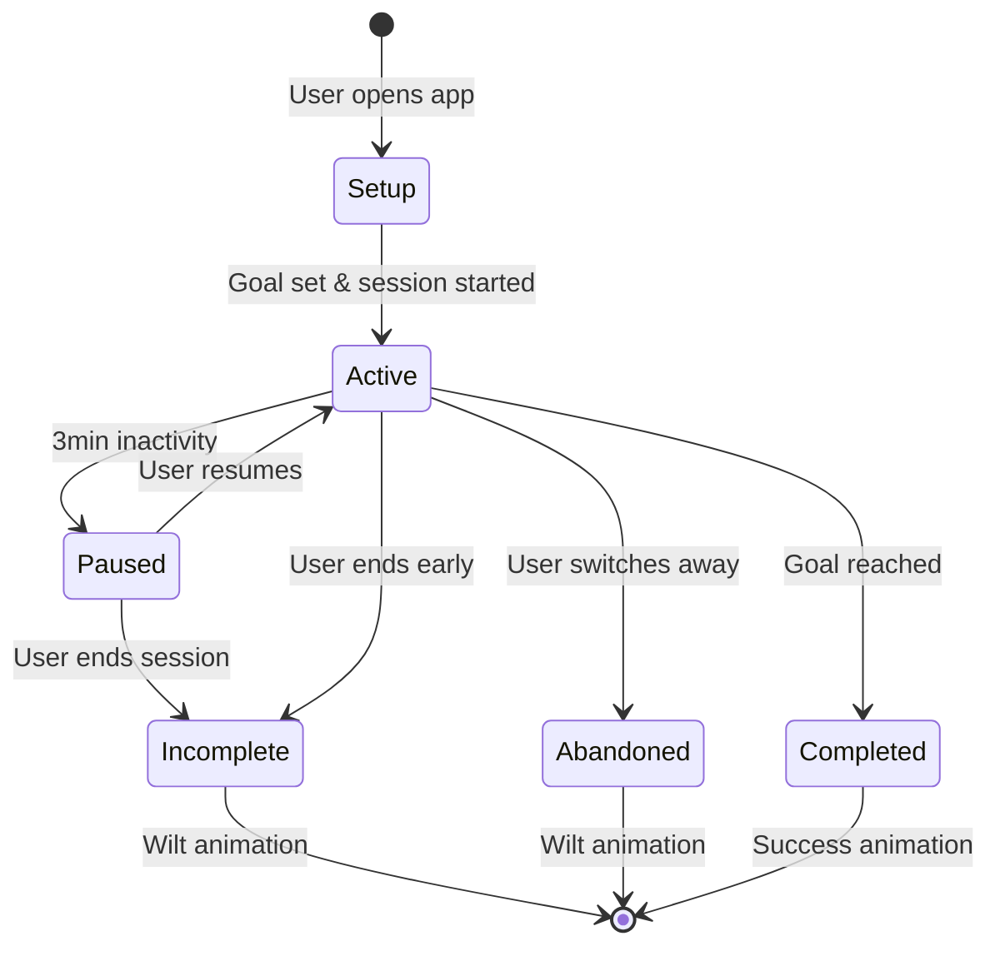

# Session Lifecycle

Complete flow of writing sessions from creation to completion or abandonment.

## Session Flow Overview



## Session States

### 1. Setup Phase
**Purpose**: User configures session parameters before starting

**User Actions**:
- Select goal type (word count or time duration)
- Set goal value within valid ranges
- Review recommended settings

**Validation Rules**:
- Word goals: 100-10,000 words
- Time goals: 5-480 minutes
- Real-time validation feedback

**Data Structure**:
```typescript
interface SessionSetup {
  goalType: 'word' | 'time';
  goalValue: number;
  isValid: boolean;
  errors: string[];
}
```

### 2. Active Phase
**Purpose**: User is actively writing toward their goal

**Key Features**:
- Real-time word count tracking
- Progress visualization
- Tree growth animation
- Timer display (for time goals)
- Autosave every 30 seconds

**State Management**:
```typescript
interface ActiveSession {
  id: string;
  startTime: number;
  goalType: 'word' | 'time';
  goalValue: number;
  currentProgress: number;
  wordsWritten: number;
  timeElapsed: number;
  isPaused: boolean;
  lastActivity: number;
}
```

**Progress Calculation**:
```typescript
// Word count goals
const progress = (wordsWritten - initialWordCount) / goalValue * 100;

// Time goals
const progress = timeElapsed / (goalValue * 60) * 100;
```

### 3. Paused Phase
**Trigger**: No typing activity for 3 minutes

**Purpose**: Maintain accurate session timing without penalties

**User Experience**:
- Session timer pauses
- Inactivity modal appears
- Clear messaging about pause (not penalty)
- Easy resume option

**Modal Content**:
- "Session Paused" heading
- "We noticed you haven't typed for a while..."
- Current progress display
- "Resume Writing" (primary) and "End Session" (secondary) buttons

**State Updates**:
```typescript
interface PausedSession extends ActiveSession {
  isPaused: true;
  pauseStartTime: number;
  totalPauseDuration: number;
}
```

### 4. Completed Phase
**Trigger**: User reaches their set goal

**Success Criteria**:
- Word goals: Written target number of words
- Time goals: Elapsed target duration

**User Experience**:
- Tree reaches mature state
- Celebration animation
- Session marked as completed
- Statistics updated
- Option to start new session

**Data Persistence**:
```typescript
interface CompletedSession {
  id: string;
  startTime: number;
  endTime: number;
  goalType: 'word' | 'time';
  goalValue: number;
  wordsWritten: number;
  timeElapsed: number;
  status: 'completed';
  completionRate: 100;
  treeState: 'mature';
}
```

### 5. Incomplete Phase
**Trigger**: User manually ends session before reaching goal

**User Experience**:
- Wilt/death animation plays
- Session marked as incomplete
- Statistics reflect incomplete session
- Clear feedback about goal not reached

**Data Persistence**:
```typescript
interface IncompleteSession {
  id: string;
  startTime: number;
  endTime: number;
  goalType: 'word' | 'time';
  goalValue: number;
  wordsWritten: number;
  timeElapsed: number;
  status: 'incomplete';
  completionRate: number; // < 100
  treeState: 'wilted' | 'dead';
}
```

### 6. Abandoned Phase
**Trigger**: User switches away from app and doesn't return within 10 seconds

**Distraction Warning Flow**:
1. User switches away from app
2. Distraction warning modal appears
3. 10-second countdown begins
4. If user returns: warning dismissed, session continues
5. If countdown expires: session marked as incomplete

**Warning Modal Content**:
- "Stay Focused?" heading
- "You are about to leave your writing session..."
- Countdown timer display
- "Return to Session" (primary) and "End Session Anyway" (secondary) buttons

**Abandonment Logic**:
```typescript
interface AbandonedSession {
  id: string;
  startTime: number;
  endTime: number;
  goalType: 'word' | 'time';
  goalValue: number;
  wordsWritten: number;
  timeElapsed: number;
  status: 'abandoned';
  completionRate: number;
  treeState: 'wilted' | 'dead';
  distractionCount: number;
}
```

## State Transitions

### Transition Rules
```typescript
const canTransitionTo = (currentState: SessionState, targetState: SessionState): boolean => {
  const validTransitions: Record<SessionState, SessionState[]> = {
    'setup': ['active'],
    'active': ['paused', 'completed', 'incomplete', 'abandoned'],
    'paused': ['active', 'incomplete'],
    'completed': [],
    'incomplete': [],
    'abandoned': []
  };
  
  return validTransitions[currentState]?.includes(targetState) ?? false;
};
```

### Transition Handlers
```typescript
const handleStateTransition = (session: Session, newState: SessionState) => {
  if (!canTransitionTo(session.status, newState)) {
    throw new Error(`Invalid transition from ${session.status} to ${newState}`);
  }
  
  session.status = newState;
  session.lastUpdated = Date.now();
  
  // Trigger appropriate animations and UI updates
  switch (newState) {
    case 'completed':
      triggerCompletionAnimation();
      updateStatistics(session);
      break;
    case 'incomplete':
    case 'abandoned':
      triggerWiltAnimation();
      updateStatistics(session);
      break;
  }
};
```

## Data Persistence

### Autosave Strategy
- **Frequency**: Every 30 seconds during active sessions
- **Content**: Editor content and session state
- **Location**: `~/Library/Application Support/focus-writer/autosave/`
- **Recovery**: Automatic recovery on app restart

### Session Storage
```typescript
interface SessionStorage {
  activeSession: ActiveSession | null;
  sessionHistory: CompletedSession[];
  autosaveData: {
    content: string;
    timestamp: number;
    sessionId: string;
  } | null;
}
```

### Recovery Flow
1. App checks for autosave files on startup
2. If recent autosave exists, show recovery modal
3. User can choose to recover or discard
4. Recovery loads content and prompts for new goal
5. Previous session marked as incomplete

## Error Handling

### Session Corruption
```typescript
const handleSessionError = (error: Error, session: Session) => {
  console.error('Session error:', error);
  
  // Attempt to recover session data
  const recoveredSession = attemptRecovery(session);
  
  if (recoveredSession) {
    // Continue with recovered data
    updateSession(recoveredSession);
  } else {
    // Mark session as corrupted and start fresh
    markSessionAsCorrupted(session.id);
    showErrorModal('Session data corrupted. Starting fresh session.');
  }
};
```

### Network/Storage Errors
- Graceful degradation for storage failures
- Retry logic for transient errors
- User notification for persistent issues
- Fallback to in-memory session data

## Performance Considerations

### State Update Optimization
```typescript
// Debounced progress updates
const debouncedProgressUpdate = useMemo(
  () => debounce((progress: number) => {
    updateSessionProgress(progress);
  }, 500),
  []
);

// Efficient state comparisons
const hasProgressChanged = useMemo(() => {
  return Math.abs(currentProgress - previousProgress) > 0.1;
}, [currentProgress, previousProgress]);
```

### Memory Management
- Clean up event listeners on session end
- Dispose of animation instances
- Clear timers and intervals
- Garbage collect unused session data

## Testing

### Session State Tests
```typescript
describe('Session Lifecycle', () => {
  it('should transition from setup to active when goal is set', () => {
    const session = createSession({ status: 'setup' });
    const updatedSession = transitionToActive(session, { goalType: 'word', goalValue: 500 });
    expect(updatedSession.status).toBe('active');
  });

  it('should pause session after 3 minutes of inactivity', async () => {
    const session = createActiveSession();
    // Simulate 3 minutes of inactivity
    await advanceTimersByTime(3 * 60 * 1000);
    expect(session.status).toBe('paused');
  });
});
```

### Integration Tests
- Full session flow from setup to completion
- Distraction warning and abandonment scenarios
- Autosave and recovery functionality
- Error handling and recovery

---

For related information, see:
- [Animation System](./ANIMATION_SYSTEM.md)
- [File Management](./FILE_MANAGEMENT.md)
- [State Management](../architecture/STATE_MANAGEMENT.md)
